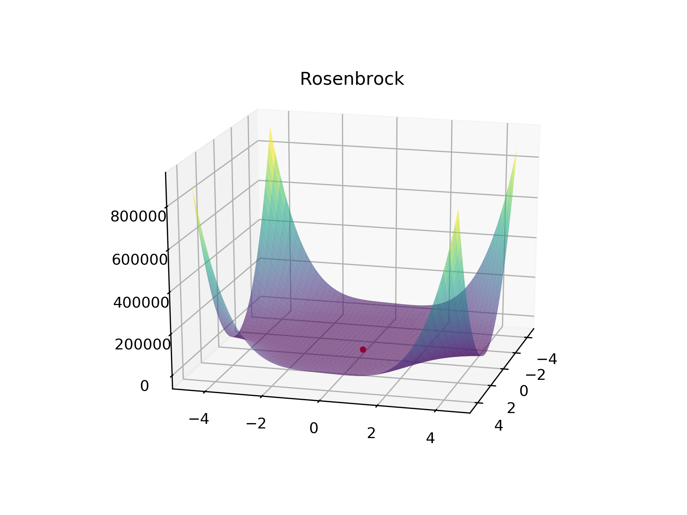
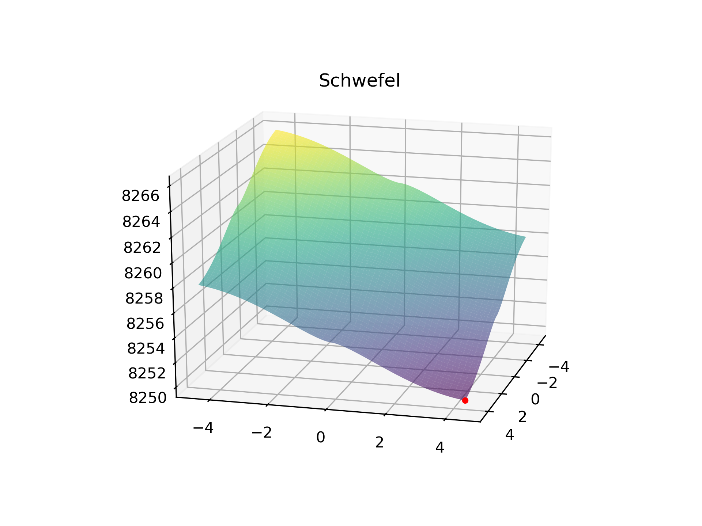

# Artificial Bee Colony Optimisation Algorithm

Here is the <a href="https://www.researchgate.net/publication/225392029_A_powerful_and_efficient_algorithm_for_numerical_function_optimization_Artificial_bee_colony_ABC_algorithm">original paper</a>.

Inspired by Bees searching for food, ABC algorithm is a powerful optimisation algorithm for problems of the form: x = argmin_x{f(x)}, where x is a vector.

